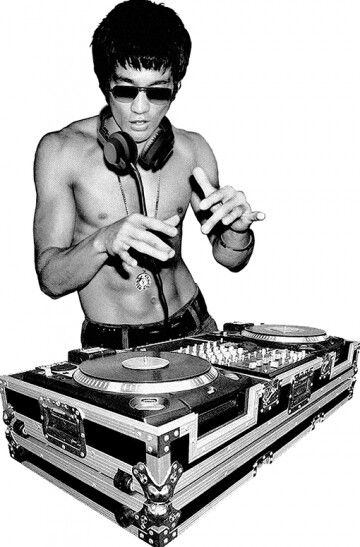

# <?xml version="1.0" encoding="UTF-8"?>

# 
 
     <?xml version="1.0" encoding="UTF-8"?>
<ImageProfile>
  <!-- Variables -->
  <Variables>
    <!-- Change this value to swap in a different main character while retaining style and pose -->
    <MainCharacter name="CharacterName"/>
  </Variables>

  <!-- Basic metadata -->
  <Title>Iconic shirtless DJ persona</Title>
  <Format>Raster (JPEG/PNG)</Format>
  <AspectRatio>Approx. 3:5 (portrait)</AspectRatio>
  <CanvasDimensions unit="pixels">~800×1300</CanvasDimensions>

  <!-- Composition & layout -->
  <Composition>
    <CanvasShape>Rectangle</CanvasShape>
    <Foreground>
      <MainFigure refVariable="MainCharacter">
        <Gender>Male</Gender>
        <Pose>
          <Torso>Upright, slightly leaning forward</Torso>
          <Arms>
            <Left>Raised above mixer deck, fingers poised mid-scratch</Left>
            <Right>Hovering over turntable, finger extended</Right>
          </Arms>
          <Head>
            <Orientation>Slightly tilted to left</Orientation>
            <Expression>Focused, mouth open as if mid-shout or beatcall</Expression>
          </Head>
        </Pose>
        <Attire>
          <Headgear>Sleek DJ-style headphones around neck</Headgear>
          <Eyewear>Dark aviator sunglasses</Eyewear>
          <UpperBody>Bare-chested, defined musculature</UpperBody>
          <LowerBody>Low-slung jeans, belt visible</LowerBody>
          <Accessories>
            <Wrist>Leather wristband or watch on right wrist</Wrist>
            <Neck>Pendant necklace resting on sternum</Neck>
          </Accessories>
        </Attire>
        <Styling>
          <Hair>Short, textured cut</Hair>
          <SkinTone>Medium tan</SkinTone>
        </Styling>
      </MainFigure>
    </Foreground>

    <Midground>
      <Equipment>
        <Turntables count="2" type="Vinyl DJ decks">
          <Platters>Standard 12-inch vinyl</Platters>
          <Mixer>3-band EQ, crossfader, channel faders</Mixer>
        </Turntables>
        <FlightCase>
          <Material>Aluminum edges, reinforced corners</Material>
          <Finish>Black matte panels</Finish>
        </FlightCase>
      </Equipment>
    </Midground>

    <Background>
      
      <Shadows>Soft drop shadow under figure and equipment</Shadows>
    </Background>

    <LinesAndFlow>
      <DirectionalLines>
        <FromHandsToDeck>Arms create implied diagonals drawing eye to turntables</FromHandsToDeck>
        <HeadphoneCurve>Headphone cable arc adds visual rhythm</HeadphoneCurve>
      </DirectionalLines>
    </LinesAndFlow>
  </Composition>

  <!-- Color palette -->
  <ColorPalette>
    <Color name="SkinHighlights" hex="#E4B891">Subtle sunlit highlights</Color>
    <Color name="SkinShadow" hex="#A67C52">Soft muscular shadows</Color>
    <Color name="DenimBlue" hex="#37474F">Jeans and equipment accents</Color>
    <Color name="MatteBlack" hex="#212121">Mixer, turntable case, sunglasses</Color>
    <Color name="MetallicSilver" hex="#B0B0B0">Mixer knobs, turntable platters</Color>
    <Color name="WhisperWhite" hex="#FFFFFF">Background and reflective highlights</Color>
  </ColorPalette>

  <!-- Themes & symbolism -->
  <Themes>
    <Theme>Fusion of martial artistry and music mastery</Theme>
    <Theme>Focus, discipline, and dynamic energy</Theme>
    <Theme>Modern reinterpretation of classic icon</Theme>
    <Theme>Strength and rhythm in harmony</Theme>
  </Themes>

  <!-- Stylistic influences -->
  <StylisticInfluences>
    <Influence>Pop-art high-contrast photography</Influence>
    <Influence>Martial arts iconography</Influence>
    <Influence>Underground DJ subculture visuals</Influence>
    <Influence>Greyscale stipple or halftone texture</Influence>
  </StylisticInfluences>
  <ArtDirection>
    <LineQuality>Sharp, clean edges with slight vignette</LineQuality>
    <DetailLevel>High: visible muscle striations, equipment grooves</DetailLevel>
    <Rendering>Photorealistic with graphic poster treatment</Rendering>
  </ArtDirection>

  <!-- Cultural context -->
  <CulturalReferences>
    <Reference type="Persona">Iconic martial artist or celebrity representation</Reference>
    <Reference type="Music">DJ culture, vinyl scratching techniques</Reference>
    <Reference type="Fusion">East-meets-West performance art</Reference>
  </CulturalReferences>

  <!-- Mood & tone -->
  <Mood>Electric, intense, commanding</Mood>
  <Tone>Edgy yet polished; reverent homage with modern twist</Tone>

  <!-- Keywords for tagging & search -->
  <Keywords>
    <Keyword>DJ</Keyword>
    <Keyword>turntable</Keyword>
    <Keyword>headphones</Keyword>
    <Keyword>vinyl</Keyword>
    <Keyword>music fusion</Keyword>
    <Keyword>high-contrast</Keyword>
    <Keyword>fitness</Keyword>
    <Keyword>iconic pose</Keyword>
  </Keywords>
</ImageProfile>

 