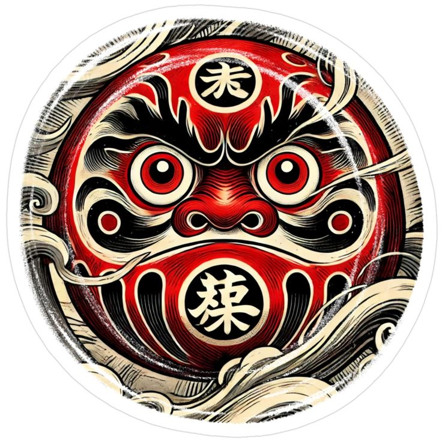
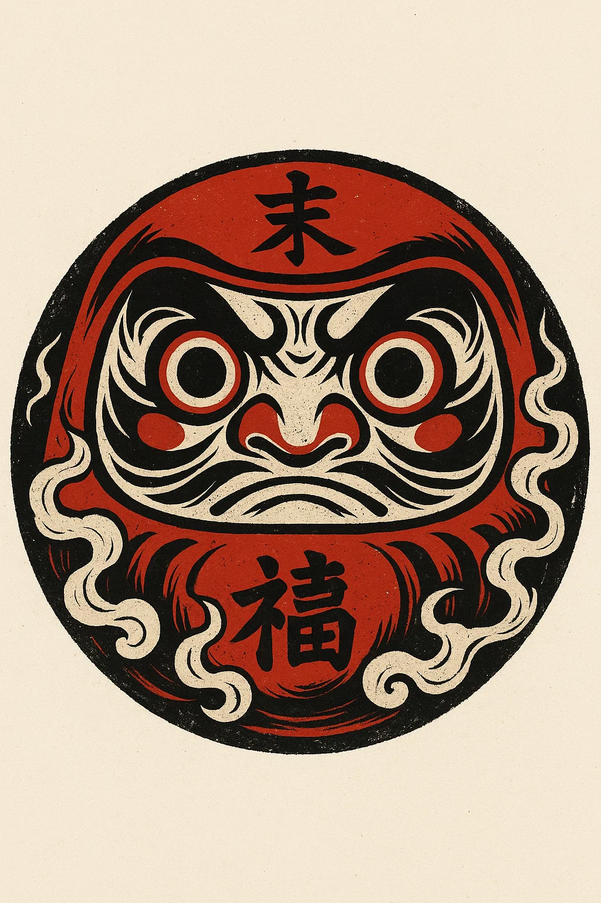

# <?xml version="1.0" encoding="UTF-8"?>

# 
 
     # <?xml version="1.0" encoding="UTF-8"?>

  
     # <ImageProfile>

  
     #   <!-- Basic metadata -->

  
     #   <Title>Fierce daruma mask emblem</Title>

  
     #   <Format>Raster (JPEG)</Format>

  
     #   <AspectRatio>1:1 (Circular)</AspectRatio>

  
     # 

  
     #   <!-- Composition & layout -->

  
     #   <Composition>

  
     #     <CanvasShape>Perfect circle</CanvasShape>

  
     #     <CentralMotif>

  
     #       <Element type="DarumaFace">

  
     #         <Eyes>Wide, concentric circles with intense stare</Eyes>

  
     #         <Brow>Bold, arched black lines evoking furrowed expression</Brow>

  
     #         <Nose>Mounded nostrils, sculpted in relief</Nose>

  
     #         <Mouth>Abstract downward curve suggesting resolve</Mouth>

  
     #       </Element>

  
     #     </CentralMotif>

  
     #     <Surroundings>

  
     #       <Element type="SwirlingSmoke">

  
     #         

  
     #         <Placement>Encircling lower and side edges</Placement>

  
     #       </Element>

  
     #     </Surroundings>

  
     #     <Calligraphy>

  
     #       <ForeheadCharacter>末 (“end”/“future”)</ForeheadCharacter>

  
     #       <ChinCharacter>禄 (“fortune”/“blessing”)</ChinCharacter>

  
     #     </Calligraphy>

  
     #     <Border>

  
     #       

  
     #     </Border>

  
     #   </Composition>

  
     # 

  
     #   <!-- Color palette -->

  
     #   <ColorPalette>

  
     #     <Color name="DarumaRed" hex="#D21C1C">Deep vermilion</Color>

  
     #     <Color name="InkBlack" hex="#000000">Strong outlines and calligraphy</Color>

  
     #     <Color name="Ivory" hex="#F2E8D8">Highlighting facial contours and smoke</Color>

  
     #     <Color name="CrimsonAccent" hex="#E63946">Inner eye rings and cheek spots</Color>

  
     #   </ColorPalette>

  
     # 

  
     #   <!-- Themes & symbolism -->

  
     #   <Themes>

  
     #     <Theme>Perseverance and determination (daruma tradition)</Theme>

  
     #     <Theme>Good fortune and blessings (calligraphic characters)</Theme>

  
     #     <Theme>Focus and inner strength (intense gaze)</Theme>

  
     #     <Theme>Balance of rough energy and refined craft</Theme>

  
     #   </Themes>

  
     # 

  
     #   <!-- Style & influences -->

  
     #   <StylisticInfluences>

  
     #     <Influence>Japanese folk talisman iconography</Influence>

  
     #     <Influence>Ukiyo-e woodblock linework</Influence>

  
     #     <Influence>Modern tattoo-flash aesthetics</Influence>

  
     #     <Influence>Grainy screen-print texture</Influence>

  
     #   </StylisticInfluences>

  
     #   <ArtDirection>

  
     #     <LineQuality>Thick-to-thin dynamic strokes</LineQuality>

  
     #     <DetailLevel>High: layered hatching and texture</DetailLevel>

  
     #     <Symmetry>Vertically symmetrical face</Symmetry>

  
     #   </ArtDirection>

  
     # 

  
     #   <!-- Cultural context -->

  
     #   <CulturalReferences>

  
     #     <Reference type="Talisman">Daruma as symbol of goal-setting</Reference>

  
     #     <Reference type="Calligraphy">Kanji for blessing and future</Reference>

  
     #   </CulturalReferences>

  
     # 

  
     #   <!-- Mood & tone -->

  
     #   <Mood>Intense, bold, resolute</Mood>

  
     #   <Tone>Traditional yet edgy; ritual meets graphic art</Tone>

  
     # 

  
     #   <!-- Keywords for tagging & search -->

  
     #   <Keywords>

  
     #     <Keyword>daruma</Keyword>

  
     #     <Keyword>Japanese folk art</Keyword>

  
     #     <Keyword>talisman</Keyword>

  
     #     <Keyword>perseverance</Keyword>

  
     #     <Keyword>calligraphy</Keyword>

  
     #     <Keyword>tattoo style</Keyword>

  
     #     <Keyword>smoke motif</Keyword>

  
     #   </Keywords>

  
     # </ImageProfile>

 
