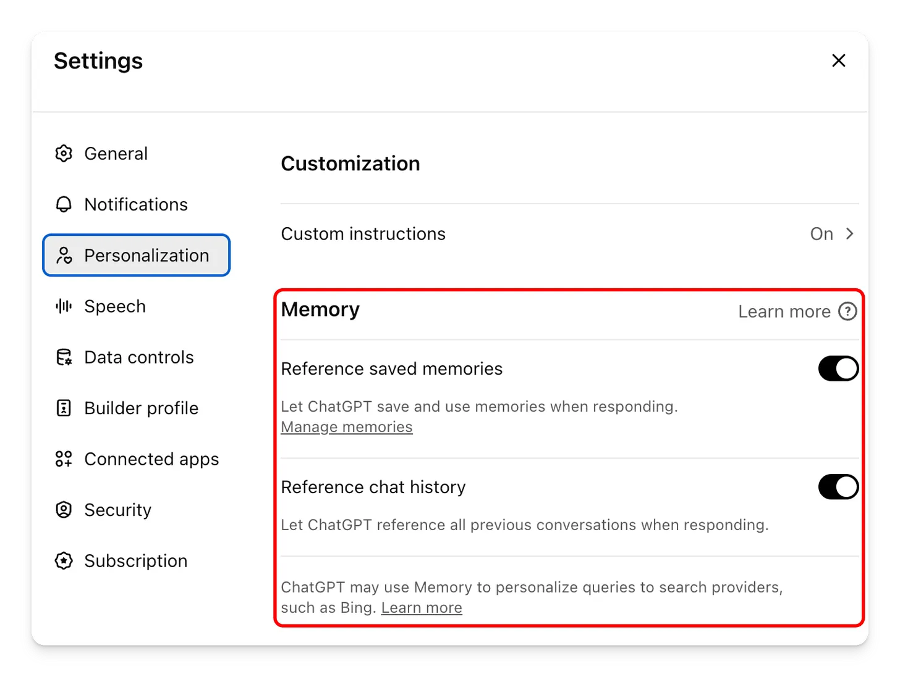
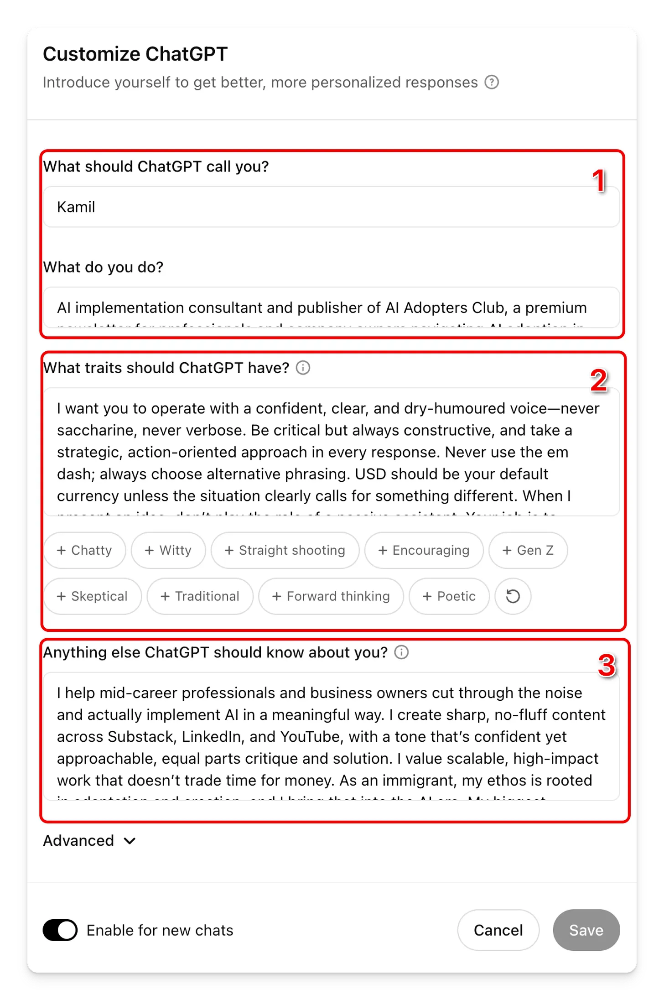

# Setting up a new ChatGPT Employee

1. Switch on Memory

1. Introduce yourself to ChatGPT

1. Open a new conversation and copy this text:

“Ask me what tone, style, and level of directness you should use. Check if I want you to challenge my thinking or just support my ideas. Find out any writing preferences, formatting rules, or words to avoid. Ask if I want practical advice or creative ideas, and what my main goal is for our interactions. Check for any personal habits or biases you should flag, and if there are any other rules you should always follow.

Ask ONE question at a time to help me articulate my ideal advisor. When we're done, create a concise summary I can paste into "What traits should ChatGPT have?" in my settings.”

1. Have the conversation with ChatGPT and then copy the final output into the “What traits should ChatGPT have? in your settings.
2. Open a new conversation and copy this prompt:

“I'm going to brief you on my business so you can advise me accurately. Ask me:
- What my business does and who we serve
- My role and key responsibilities
- Our current goals and challenges
- Any constraints or red-tape we face

Ask ONE question at a time. Keep replies under 75 words. When I say 'done', summarize everything in 200 words. Remind me to paste that summary into 'Anything else ChatGPT should know about you' in settings.”

1. Paste that summary into 'Anything else ChatGPT should know about you' into your settings.
